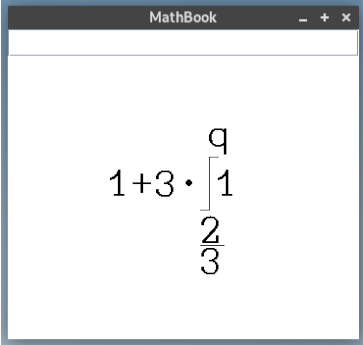
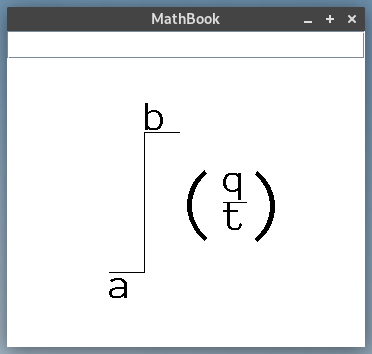

# MathDrawer

### Info:
Mathbook a simple tool that allows you to write Math Expressions on the fly and can therefore be used as a virtual Math-Blackboard.

### Idea:
The idea behind "MathBook" was born during the Corona-lockdown as an easy way to have virtual Math-lessons. The Teacher simply shares his screen over e.g. Teams and is able to write Math-Expressions without the need of a Touchscreen!

### Implementation:
The program is implemented in Java using the Swing library. It uses a modified Font, to ensure good looking math-expressions. To make it as easy as possible for the user, to write Math-expressions, a "LaTeX" like language was implemented.

### Usage:
- By left-clicking anywhere on the screen, a new Math-Expression is created.
- After clicking the user can simply enter a valid Expression(look "syntax") in the TextBox at the top of the Window.
- Using the Mousewheel the Expression size can be changed!
- With another left-click, the Expression can be placed anywhere on the screen.
- An Expression can be modified by simply left-clicking it. 
- By holding Control & left-click, the user can draw on the Screen.
- Using Control & right-click, the user can erase drawn things.
- By clicking Control C, the screen can be cleared.

### Expression-Language Syntax:
- Spaces are ignored
- $ followed by a letter introduces a new "special symbol"
- List of special symbols:
	 >>Integal -> $i
	>>Power -> $p
	>>Fracture -> $f
- a special symbol has to be followed by a certain of arguments (e.g. $i {arg1} {arg2}....)
- IMPORTANT: for an Expression to be valid, not all Arguments have to be supplied 

#### Examples of Valid Expressions:
	* 1+3 * $i { 1 } { $f{2}{3} }  { q }
	* $i{ ( $f { q } { t } ) } { a }  { b }
	* 1* $p { 1 } { 10 }
	* 5 * ( $ f{ 3 } ) 

#### Examples:

### Running MathBook:
The program can be run by simply running the "run.sh" file

 >>bash run.sh

#### Screenshots:

